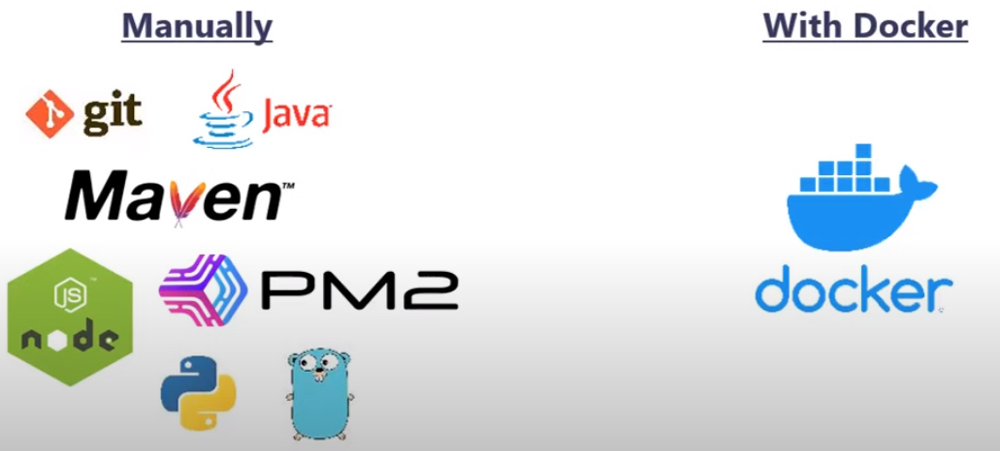
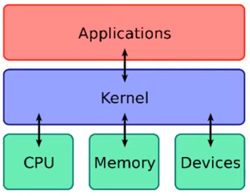
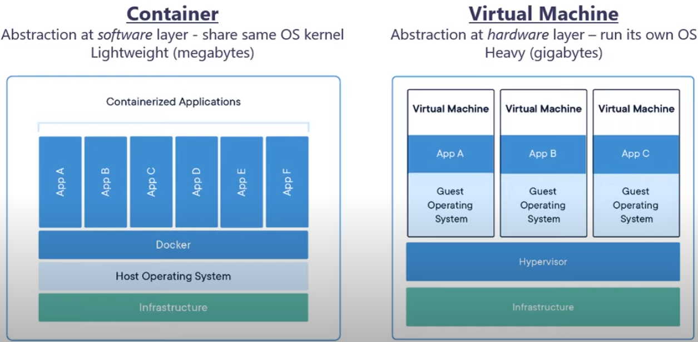
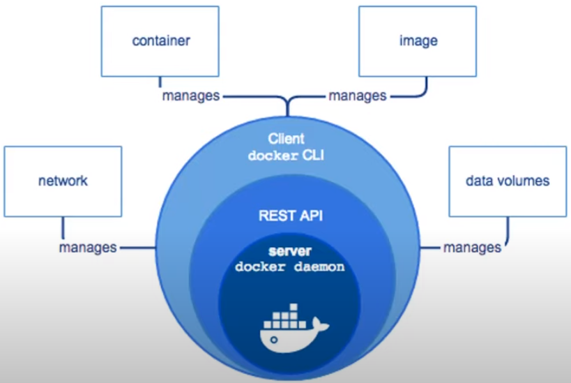
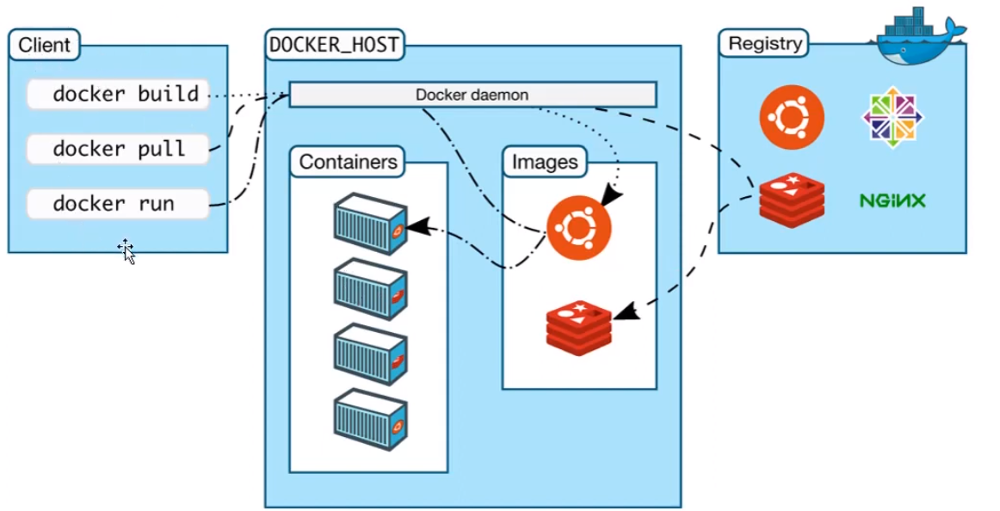
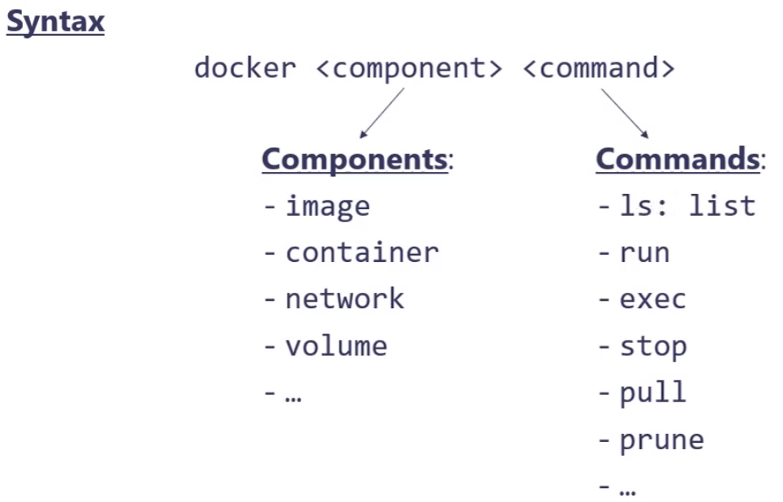

## 📔 Docker

## 1. Khái niệm docker
- **Khái niệm**: giúp giảm tải phải cài nhiều các phần mềm phụ thuộc khi khởi chạy 1 ứng dụng, giúp ta cho thể mang phần mềm đó đi chạy trên bất kì 1 máy nào khác nếu máy đó cài được docker. Nếu giả sử docker không tồn tại thì ta lại phải cài lại tất cả các phần mềm khi chạy trên từng máy khác nhau, mà chưa hết nó có thể còn rắc rối hơn khi cần đúng version hoặc có thể bị conflict với hệ điều hành nữa. Vì vậy ở đây có docker lo hết, chỉ cần 1 lệnh run trên docker thì bạn có thể chạy ứng dụng trên bất kì môi trường nào window/linux/mac 1 cách cực kì đơn giản. Ví dụ để khởi chạy 1 dự án spring boot thì bạn cần tối thiểu các phần mềm sau nè: JDK, postgreSQL, Tomcat, Inteliji... Khi có docker bạn chỉ cần chạy dockerfile là đủ. 



- **Image**: là các package được docker đóng gói các thư viện và nền tảng thực thi duy nhất. Ví dụ: đóng gói postgreSQL thành 1 file nên đó là postgreSQL image.
- **Container**: Khi 1 image được khởi chạy sẽ tạo ra container. Nó hoạt động như một máy ảo với đầy đủ tính năng để cài đặt và chạy bất cứ phần mềm nào bên trong nó. Nhưng mà nó không thực sự là máy ảo vì không có kernel hệ điều hành của riêng nó, docker sử dụng chung bộ nhân của hệ điều hành vật lí trên máy của chúng ta. Vậy nên nó chỉ là 1 tiến trình trên hệ điều hành và được docker quản lí thôi.
- **Kernel**: nó là nhân, là trái tim của hệ điều hành, kiểm soát toàn bộ mọi tiến trình trong máy chúng ta, nó giao tiếp giữa tầng ứng dụng và phần cứng  (CPU, Hardware, Devices) 



- **Container** vs **Virtual machine**
  - **Container**: Sử dụng công nghệ ảo hóa ở tầng software, docker chính là công nghệ ảo hóa đó, các container tận dụng phần core, kernel của hệ điều hành máy chủ vật lí do đó không tốn dung lượng để cài thêm 1 hệ điều hành nào, dung lượng của các container cực kì nhẹ đổi lại không có sự tự do như máy ảo, bạn không thể chạy container ubuntu trên window 
  - **Virtual machine**: sử dụng công nghệ ảo hóa ở tầng hardware, máy chủ vật lí sẽ được cài lên trên 1 phần mềm ảo hóa chuyên dụng như VMWare... Có nhiệm vụ phân tài nguyên vật lí cho máy ảo con bên trên, mỗi máy ảo này có hẳn 1 hệ điều hành độc lập bên trong, chúng sử dụng phần core, kernel của riêng nó, có thể cài nhiều máy ảo trên cùng 1 hệ điều hành.



- Về bản chất công nghệ bên dưới docker viết bằng golang, tận dụng lại tính năng được cung cấp bởi nhân linux như là namespace, control groups, union file systems, container format.
- 3 tính chất của docker (microservice)
  - Tính bất biến(Imutable): chạy trên mọi môi trường đều như nhau
  - Tính nhẹ(lightweight): nhẹ hơn máy ảo nhiều, tạo nhanh chóng
  - Stateless: không tạo ra thay đổi dữ liệu bên trong nó, nhân container lên 100 lần cũng được, có thể tắt container này, bật container kia dễ dàng
## 2. Các khái niệm cơ bản



- **Docker engine**: là docker được cài trên máy(hay gọi là docker)
  - **Docker deamon & exposed APIs**: đóng vai trò là server chạy ngầm bên dưới hệ thống 
  - **Docker clients(cli)**: đóng vai trò là client, dùng các câu lệnh để giao tiếp với docker daemon thông qua giao thức https 
  - Do sử dụng chung kernel với hệ điều hành nên là chỉ có thể chạy được container của hệ điều hành đó, do đó khi cài lên window thì docker yêu cầu bật hyper-V hoặc VirtualBox và cài máy ảo linux, cục docker daemon sẽ được cài trong máy ảo linux đó 
- **Container registry**: là kho lưu trữ các image để đẩy ứng dụng lên mạng chia sẻ cho các máy khác 
-  Các nhà lưu trữ docker image khác nhau: docker hub, amazone elastic container registry(ECR)...

 

- Khi chay các câu lệnh client thì các image đươc lưu trữ trên registry được tải lưu về máy local, khi chạy các image này sẽ được các container
## 3. Một số lệnh cơ bản trong docker



### 1. Các lệnh docker image
Dùng để tải image từ registry về
```
$ docker image pull <image>
```
Dùng để tải image từ registry về  và đánh các tag version
```
$ docker image pull <image>:<tag>
```
Dùng để tải image từ local lên registry và đánh tag
```
$ docker image push <image>:<tag>
```
Dùng để liệt kê các image đang có trong máy local
```
$ docker image ls | docker images
```
Xóa tòan bộ image không còn được dùng nữa
```
$ docker image prune 
```
Các câu lệnh short-hand chỉ dành cho image
```
$ docker pull
$ docker push
```
### 2. Các lệnh docker container
Để chạy 1 container thì dùng lệnh
```
$ docker container run <image>
```
Để liệt kê container đang chạy | liệt kê container đã shutdown
```
$ docker container ls | docker container ls -a
```
Các câu lệnh short-hand chỉ dành cho container
```
$ docker ps
$ docker ps -a
```
Dùng container đang chạy
```
$ docker container stop <container_id>
```
Xóa các conainer đã được shutdown không còn được dùng nữa
```
$ docker container prune
```
Chạy 1 câu lệnh trong container bất kì 
```
$ docker container exec <container_id> <command>
```
Các câu lệnh short-hand chỉ dành cho container
```
$ docker run
$ docker stop
$ docker exec
```


